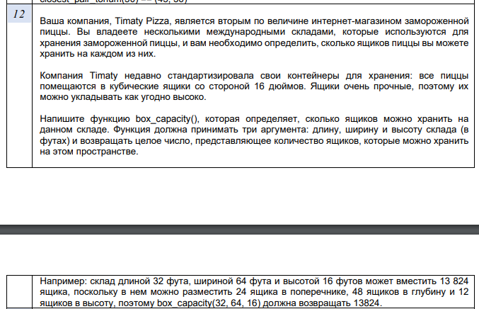

# **Лабораторная работа *№ 1*** #

## Цель ##
- Изучение системы сборки на языке C++, изучение систем контроля версии.
- Изучение работом с память в C++
- Изучение работы с вводом/выводом в стандартный поток

## Задачи ## 
- Установить компилятор С++
- Установить систему сборки cmake
- Установить систему управления версиями git
- Установить систему unit-тестирования Google Test
- Установить и настроить Visual Studio Code
- Написать программу согласно варианта задания
- Написать тесты согласно варианта задания
- Завести аккаунт на github (если нет) и опубликовать репозиторий
- Отправить ссылку на репозитарий в lms.mai.ru

## Задание для *12* варианта ## 

)
