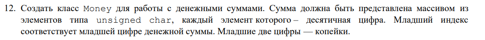

# **Лабораторная работа *№ 2*** #

## Цель ##
- Закрепление навыков работы с классами
- Закрепление навыков работы с динамической памятью на «куче»
- Закрепление навыков работы с массивами
 

## Требования к программе ## 
Используя в качестве образца класс Array (см. ниже), реализовать динамические контейнеры с использованием динамического массива.
- Каждый класс должен быть разделен на интерфейс и реализацию.
- Самостоятельно определить необходимые типы, поля и дополнительные методы.
- Реализовать генерацию исключений в конструкторах и методах при необходимости (использовать стандартные исключения).
- Реализовать арифметические операции: сложение, вычитание, копирование
- Реализовать операции сравнения: (больше, меньше, равно).
- Арифметические операции с присваиванием должны быть реализованы как методы класса. 

## Задание для *12* варианта ## 

)
